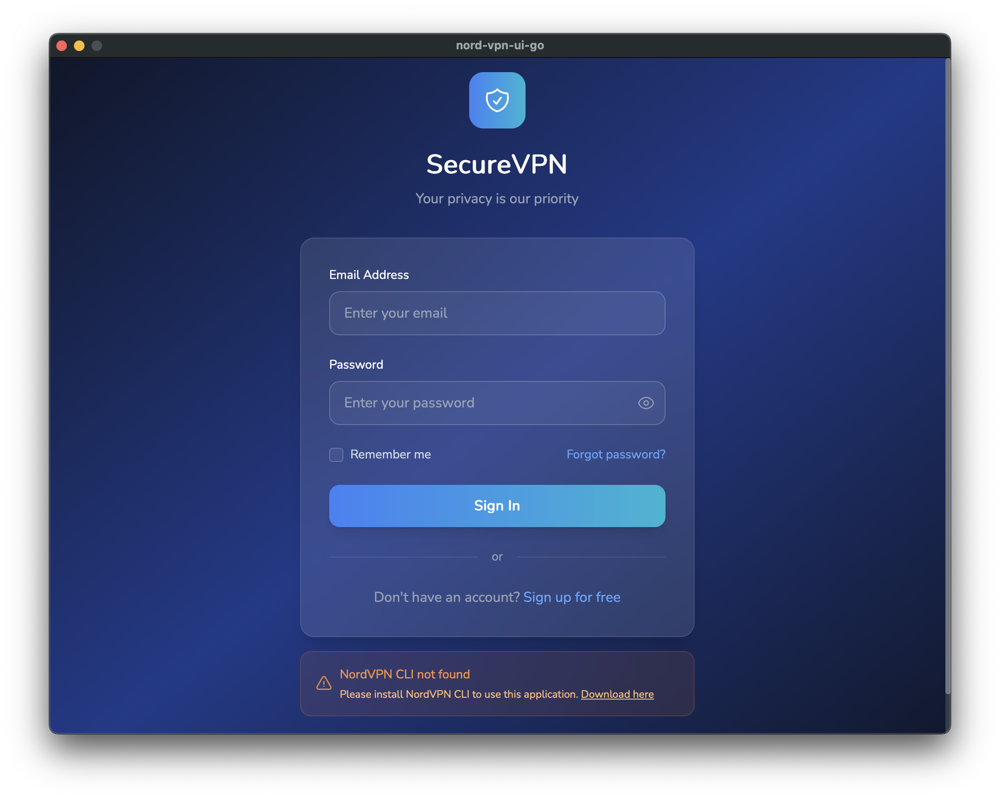

# NordVPN UI Go

A modern desktop application for NordVPN built with Wails (Go + React + TypeScript).



## Features

- 🔐 Secure authentication with NordVPN
- 🌍 VPN dashboard with connection management
- 🎨 Modern UI built with React and TypeScript
- ⚡ Fast native performance with Go backend
- 🖥️ Cross-platform desktop application

## Prerequisites

- Go 1.18+
- Node.js 16+
- NordVPN CLI installed on your system

## Installation

1. Clone the repository:
```bash
git clone https://github.com/your-username/nord-vpn-ui-go.git
cd nord-vpn-ui-go
```

2. Install dependencies:
```bash
npm install
```

## Development

To run in live development mode:

```bash
wails dev
```

This will run a Vite development server with hot reload. You can also access the dev server at http://localhost:34115 to call Go methods from browser devtools.

## Building

To build a redistributable, production mode package:

```bash
wails build
```

## Project Structure

- `app.go` - Main Go application logic
- `main.go` - Application entry point
- `frontend/` - React TypeScript frontend
  - `src/components/` - React components
  - `src/store/` - State management
- `docs/` - Documentation and screenshots

## License

This project is licensed under the MIT License - see the [LICENSE](LICENSE) file for details.

## Configuration

You can configure the project by editing `wails.json`. More information about project settings can be found in the [Wails documentation](https://wails.io/docs/reference/project-config).